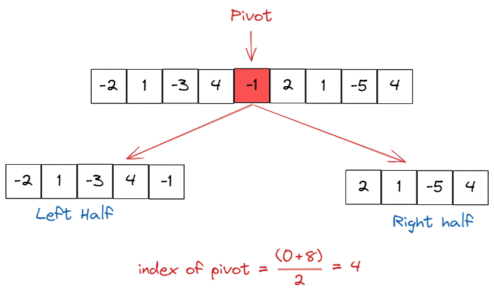
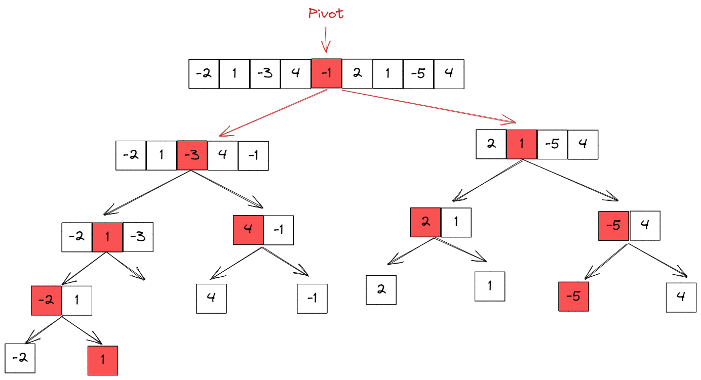
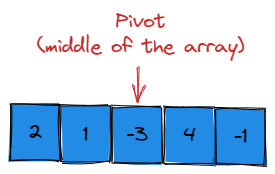
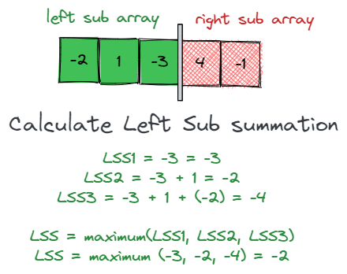
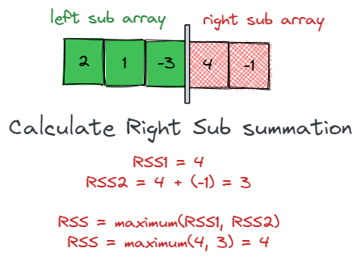
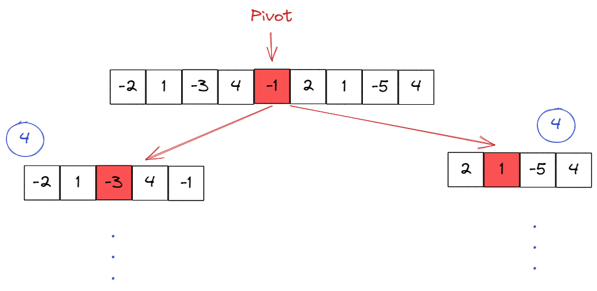
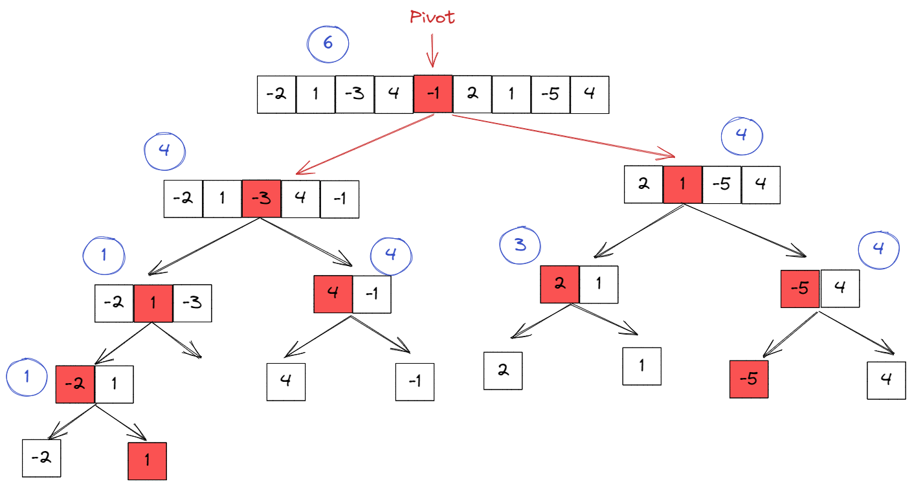

# Maximum subarray (Devide and Conqure)
**problem description**: Given an integer array numbers, find the contiguous subarray (containing at least one number) which has the largest sum and return the sum.

# How to solve
We will start off by giving an example, then we will solve the problem 1 by 1.
 - Example input: `[-2, 1, -3, 4, -1, 2, 1, -5, 4]`
 - Expected output: `6`
 - Explanation:  `[4, -1, 2, 1]` has the largest sum of `6`.

 onto the solution:
## 1. devide
first off we wil devide the array to 2 halfs (left sub array, right subarray)

the way we can do this is by finding the middle of the array index (known as **pivot**)

index of pivot = $\dfrac{being+end}{2}$  
left sub array = `begin` -> `pivot` __(inclusive)__  
right sub array = `pivot+1` -> `end` _(doesn't include the pivot)_

repeat the process until you find all sub arrays

## 2. Conquer: maximum sum
now to find the largest sum of a sub array, you need to find the maximum sum for each sub array.

To start finding the maximum sum for each sub array, you must work from the **bottom first**, as you read the steps to find the **maximum sum**, you wil realize that the solution depends on the previous sub array

Steps:
 1. find the middle of the sub array (pivot)
 
 

 2. calculate the left sub array (LSS) starting from the middle (meaning pivot is included in the calculations)

 

 3. now, calcualte the right sub array (RSS) starting from pivot+1 (meaning pivot is not included in the caluclations)

 

 4. finally, to find the cross sum (**CSS**), add *LSS* & *RSS* togther to get the final answer
    - $CSS = LSS + RSS = -2 + 4 = 2$

now you got your CSS, it is now time to calculate the maximum sum by finding the maximum between (LSS, RSS, CSS)

  now we found `CSS`, `LSS`, and `RSS`. to find **Maximum Sum** we simplify have to find the **Maximum Sum** for both the previous left sub array and the previous right sub array! 

   we can find the **Maximum Sum** of the previous sub arrays are `Left sub array = 1`, and `Right Sub array = 4` **(see image below)**, and the previous steps helped us to find `CSS = 2`.
  
  So to find maximum we need to compare `CSS`_(from the **current** sub array)_, `left sum` _(from the **left** sub array)_ _(AKA **Maximum Sum**)_, and `right sum` _(from the **right** sub array)_ _(**Maximum Sum**)_ and find the biggest number.

  
  $M=max=(CSS,LS,RS)=max(2, 1, 4) = 4$

  and in this way we have found the maximum sum for this sub array and we can move onto the next one.

## 3. combine 
  now after we found all the **maximum sum** for the sub arrays, we now need to calculate the final answer

  your current solutions should look something like this:

  

  left sum is = 4 
  Right sum array is = 4

  now we are going to repeat the steps in [2. Conquer: maximum sum](#2-conquer-maximum-sum)

  $
  \:$ - Povit $\:=-1\newline
  \:$ - Left Sum $\:=4\newline
  \:$ - Right Sum $\:=4\newline
 \:$ - Left Sub array $\:= \{-1, -1+4, -1+4+(-3), -1+4+(-3)+1, -1+4+(-3)+1+(-2)\}=3\newline 
 \:$ - Right Sub array $\:= \{2, 2+1, 2+1+(-5), 2+1+(-5)+4\}=3 \newline
 \:$ - Cross sum $\: = 3+3 = 6\newline
 \:$ - maximum sum $\: = max(6, 4, 4) = 6
  $

### final solution:
  